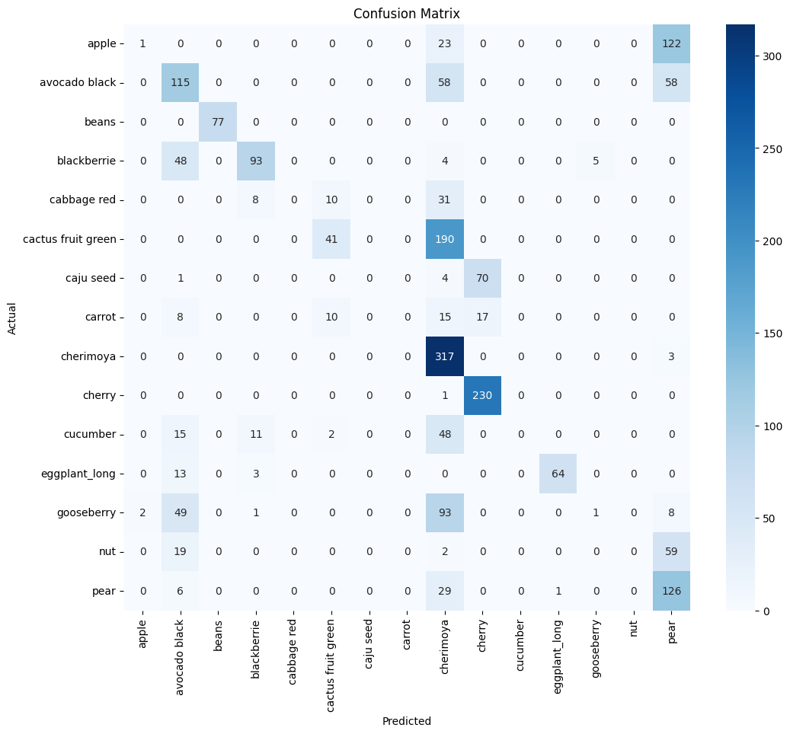
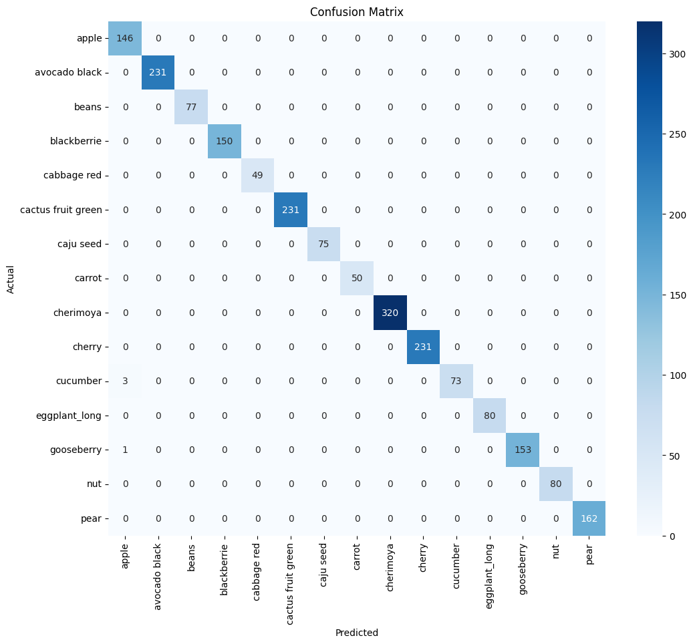
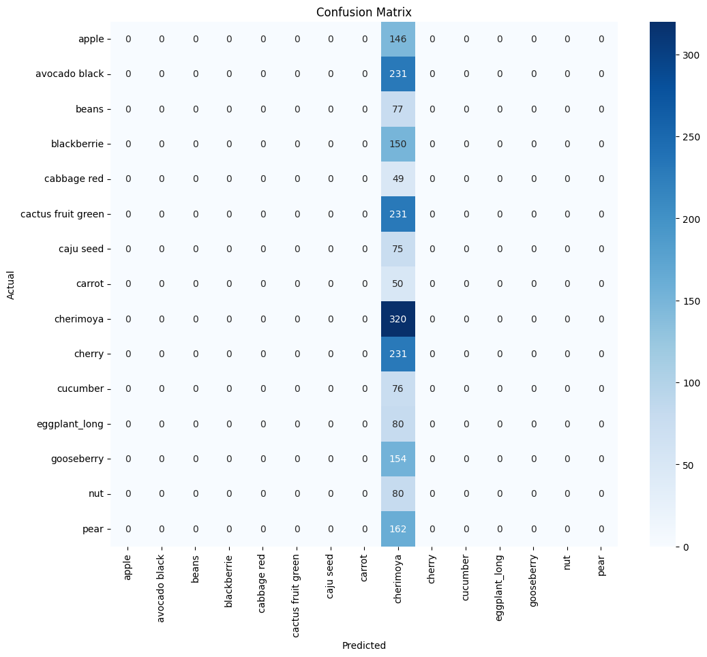

# Fruits classification

For code click on the following 
- [Code](Classifiers\Fruits\fruit_classifier.ipynb)

## Dataset Description

- The dataset had 40+ classes
- Truncated it to 15 classes
- For pretrained models, Vgg16, ResNet50 and EfficientNet-B0, original sizes were inputed which were later reshaped to 224, 224.
- 224, 224 is the size expected by these three models 

## Folder Structure
- Fruits-360/Train/Apple(..)
- Fruits-360/Test/Apple(..)
- Fruits-360/Val/Apple(..)

# Model 

## Data Preparation

- Added data augmentations through Image Generator 
- For training, the augmentations include rescaling (normalization -> necessary), zoom, shifts, etc
- For test and val, only relied on rescaling. 

## Results

### Resnet

- Training time = 67m
- Test Accuracy = 50%

### Vgg16

- Training time = 338m
- Test Accuracy = 99.8%

### EfficientNetB0

- Training time = 38m
- Test Accuracy = 15%

