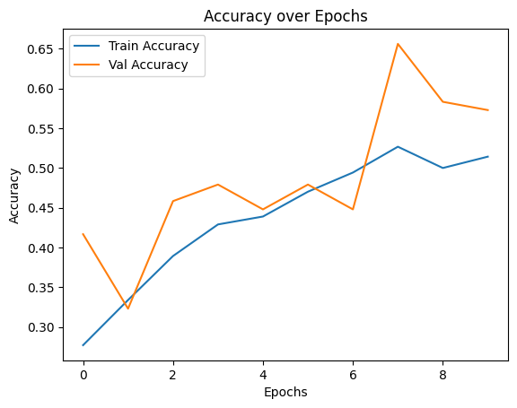
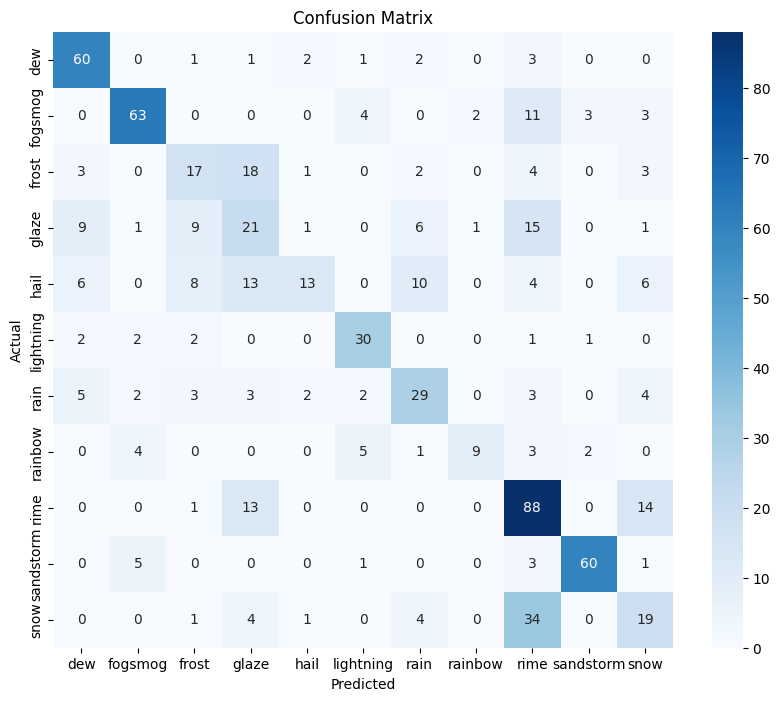

# Weather Classifier

### Preparing data for flow directory

- Prepared by using the train_test_split
- Train = 80%
- Val = 10% of 80% training
- Test = 10%

### Data Augmentation 

#### Train data 
- re scale 
- horizontal shift
- rotation_range
- width_shift_range
- shear_range
- zoom_range
- horizontal_flip
- height_shift_range

#### Test and val data 

- Only rescaled to 1/255

### Generation of Augmented Data 

#### Train 
- target size = 224,224
- batch_size=16
- class_mode = sparse -> since data is not one hot encoded

#### Val, Test 
- target size = 224,224
- batch_size=16
- class_mode = sparse -> since data is not one hot encoded

### Model Improvement

#### First Model 

- Accuracy = 19%
- Problem was the sigmoid activation in 2nd layer
- Sigmoid led to loss of features in starting layers

### Second Model 

 

 

- Improved Accuracy but still alot of misclassifications

 

 

### Third Model

- Using a pretrained model **MobileNetV2** with weights = imagenet