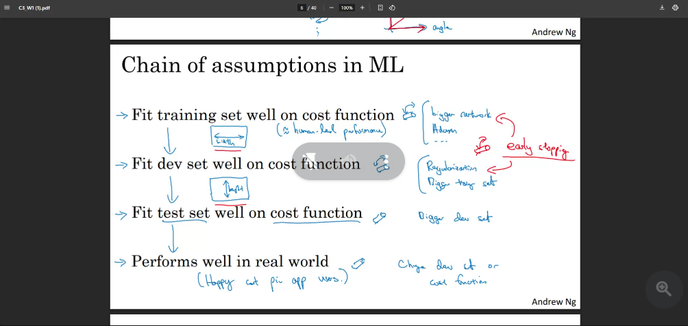

Low Accuracy -> high bias -> underfit 

High accuracy -> -> overfit 

### Underfitting 

- bigger network

### Overfitting

- compare training and test data acc
- add more data 
- regularization

### Bias and Variance Tradeoff

- Interview Qs : For dealing with bias, we are adding a bigger network but if we regularization, we are comprising bigger network.
- Ans: We are distributing its learning ability. Some neurons will see some things others would see other.

### Train/ Dev/ Test Sets

- Split (99% training, 1% test, 1% val)
- Until now, we used test set (20%) as validation set
- At the end of each epoch run val set
- If we have 80k data from int 20k from client
- train = 80k, val = 10k, test = 10k 

 

 

